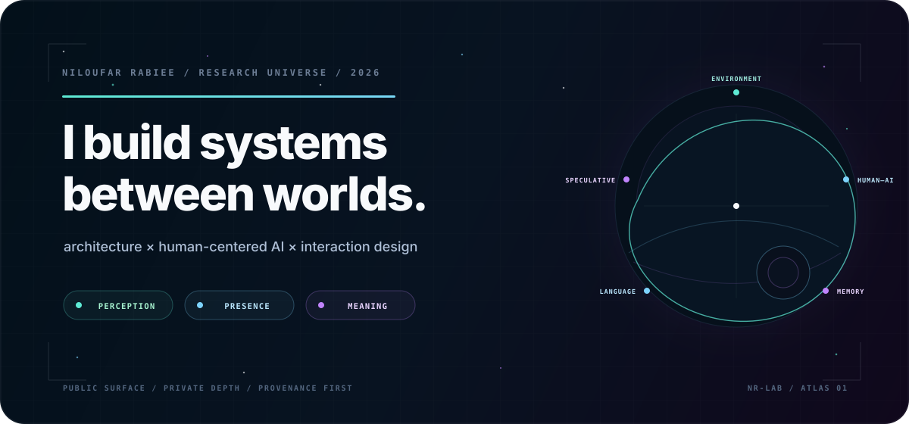
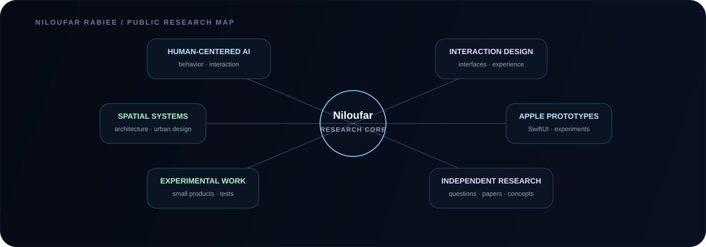
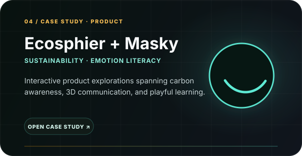
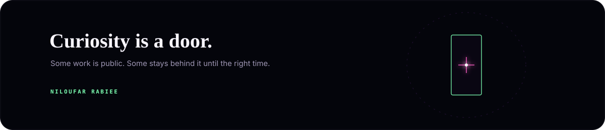

  

  
  
  

 

## About

I am an architect and multidisciplinary designer working across **architecture, human-centered AI, interaction design, and digital products**.

I am interested in technology that feels thoughtful rather than loud — systems that respond to context while keeping people in control.

> **How can technology become more responsive without becoming more intrusive?**

That question connects much of what I build.

 

## Public research map

This is a deliberately high-level view of my practice. It shows the fields I work across without exposing unpublished or sensitive project details.

  

  

## Selected public work

  
  

  
  

  

## Practice

I move between **physical space and digital interaction** rather than treating them as separate disciplines. Architecture gives me a way to think about behavior, movement, atmosphere, accessibility, and context; software lets me prototype those ideas as interactions people can actually use.

The process is usually the same: **research → frame the problem → prototype → test → refine**.

 

## Focus

  
  
  
  
  
  

 

## Tools

  
  
  
  
  
  

  

## Connect

I am open to thoughtful collaborations and opportunities across **architecture + technology, human-centered AI, spatial computing, interaction design, and experimental digital products**.

  <a href="https://niloufarrabieeusa.com"><b>Portfolio</b></a>
  &nbsp;&nbsp;·&nbsp;&nbsp;
  <a href="https://www.linkedin.com/in/niloufar-rabiee-55447325a/"><b>LinkedIn</b></a>
  &nbsp;&nbsp;·&nbsp;&nbsp;
  <a href="mailto:rabiee.niloo@gmail.com"><b>Email</b></a>

 

  

  Designed and curated by <b>Niloufar Rabiee</b> · 2026

