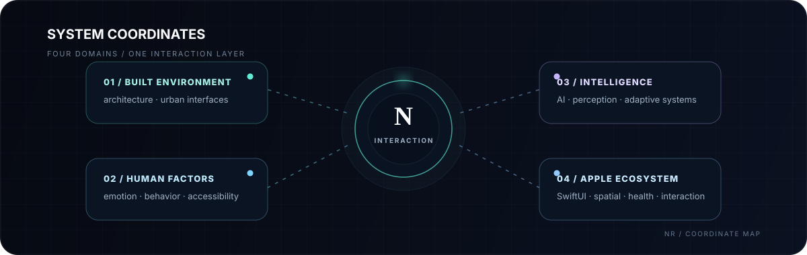
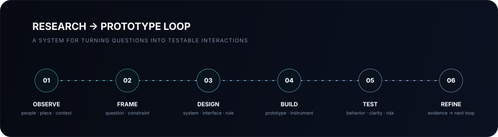

> y = 1 if at least one x_i = 1; otherwise y = 0 — equivalently, y = 1 − ∏ (1 − x_i), with x_i ∈ {0,1}.

<p align="center">
  
</p>

<p align="center">
  <a href="https://niloufarrabieeusa.com"></a>
  <a href="https://www.linkedin.com/in/niloufar-rabiee-55447325a/"></a>
  <a href="mailto:rabiee.niloo@gmail.com"></a>
</p>

<p align="center">
  <sub>SPACE ↔ HUMAN ↔ SIGNAL ↔ SYSTEM</sub>
</p>

<br/>

## `01 / signal`

I design **cross-disciplinary systems** at the boundary of architecture, interaction, human-centered AI, and Apple-platform development.

The goal is not technology for its own sake. I am interested in what happens when a system must **sense context, preserve human agency, communicate clearly, and respond with restraint**.

> ### What should technology understand before it decides how to respond?

That question connects most of my work: from spatial interfaces and affective interaction to small, deliberately simple digital products.

<p align="center">
  
</p>

<br/>

## `02 / selected work`

<table>
<tr>
<td width="50%" valign="top">

<sub>SHIPPED · APP STORE</sub>

### FeelPrint
**Emotion tracking · SwiftUI · on-device logic**

A deliberately compact three-screen emotion tracker designed to reduce interaction friction and keep reflection lightweight.

[](https://apps.apple.com/it/app/feelprint/id6746127790?l=en-GB)

</td>
<td width="50%" valign="top">

<sub>SHIPPED · APP STORE</sub>

### One Button Decision Maker
**Decision UX · minimal interaction · iOS**

A noise-free decision tool built around a single interaction for moments when cognitive overhead is the actual problem.

[](https://apps.apple.com/it/app/one-button-decision-maker/id6743403533?l=en-GB)

</td>
</tr>
<tr>
<td width="50%" valign="top">

<sub>EXPERIMENT · AFFECTIVE INTERACTION</sub>

### MoodShift
**AI-assisted adaptation · emotion-to-mechanics loop**

An experimental mini-game investigating how changing affective signals can modify interaction and game behavior in real time.

[](mailto:rabiee.niloo@gmail.com?subject=MoodShift%20TestFlight%20Invite%20Request)

</td>
<td width="50%" valign="top">

<sub>DESIGN STUDIES · TEAM + INDEPENDENT</sub>

### Ecosphier + Masky
**Sustainability · emotion literacy · 3D / interactive UX**

Explorations spanning environmental interaction, immersive visual communication, and playful emotional learning.

[](https://niloufarrabieeusa.com/ui-ux-design--designing-feelings--not-just-interfaces)

</td>
</tr>
</table>

<br/>

## `03 / how I build`

<p align="center">
  
</p>

I prefer a **research → prototype → evidence → refinement** workflow. A concept becomes interesting when it can be made explicit enough to test: what is sensed, what is inferred, what changes, what can fail, and what the person actually experiences.

<br/>

## `04 / operating principles`

```text
01  HUMAN FIRST        technology should clarify, not compete for attention
02  CONTEXT MATTERS    behavior only makes sense inside an environment
03  CALM > LOUD        intelligence does not need visual noise to feel advanced
04  BUILD TO TEST      ideas become useful when they survive interaction
05  PRIVACY BY DESIGN  sensing context should not require exposing identity
```

<br/>

## `05 / working stack`

**Build**

<p>
  
  
  
  
  
  
</p>

**Investigate**

<p>
  
  
  
  
  
  
</p>

<br/>

## `06 / current signal`

<table>
<tr>
<td width="33%" valign="top">

### SPACE
Architecture is not a backdrop. It changes behavior, attention, movement, interpretation, and trust.

</td>
<td width="33%" valign="top">

### INTELLIGENCE
AI is most useful when its inference is legible enough to challenge, constrain, and evaluate.

</td>
<td width="33%" valign="top">

### INTERACTION
The interface is where a technical system becomes a human experience — or fails to.

</td>
</tr>
</table>

<br/>

## `07 / connect`

I am interested in thoughtful collaborations across **human-centered AI, spatial computing, architecture + technology, affective interaction, accessibility, and experimental Apple-platform products**.

<p align="center">
  <a href="https://niloufarrabieeusa.com"><b>PORTFOLIO</b></a>
  &nbsp;&nbsp;·&nbsp;&nbsp;
  <a href="https://www.linkedin.com/in/niloufar-rabiee-55447325a/"><b>LINKEDIN</b></a>
  &nbsp;&nbsp;·&nbsp;&nbsp;
  <a href="mailto:rabiee.niloo@gmail.com"><b>EMAIL</b></a>
</p>

---

<p align="center">
  <i>When technology feels, it connects. That’s where real innovation begins.</i>
  <br/><br/>
  <sub>Designed & built by <b>Niloufar Rabiee</b> · 2026</sub>
</p>